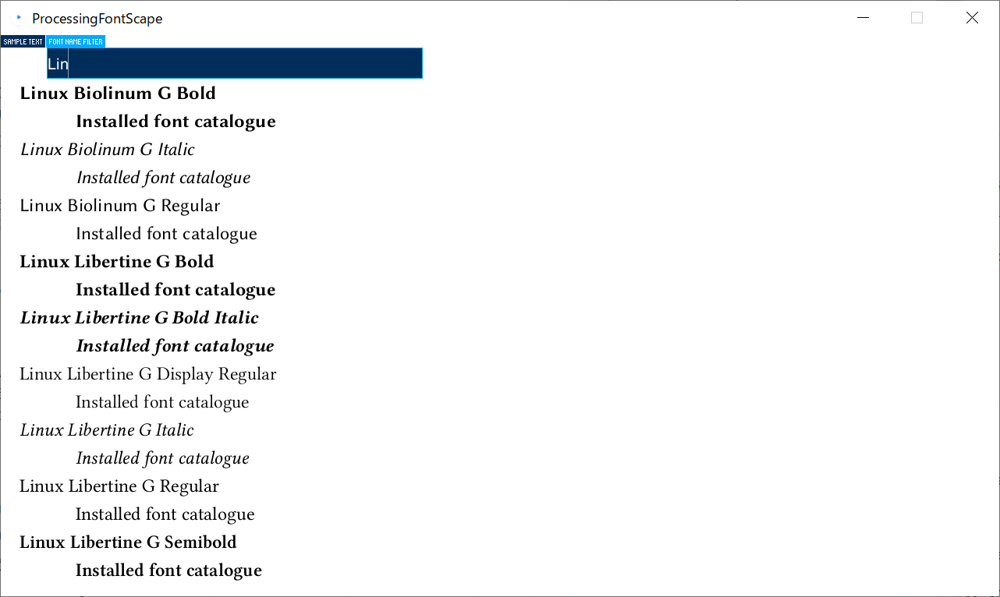

# ProcessingFontScape

ProcessingFontScape is a small utility that draws a list of fonts available in Processing. The elements of the list are the font name and the sample text, displayed in the corresponding font.

## Requirements

ProcessingFontScape needs [Processing 4 or later](https://processing.org/) to run.

ProcessingFontScape also requires [ControlP5](https://sojamo.de/libraries/controlP5/). Please install it using Contribution Manager before running.

## Usage

- When started, ProcessingFontScape displays a list of font names and sample, text drawn with the corresponding font.
- You can scroll the list with the mouse wheel (for mouse) or two-finger drag (for touchpad).
- The font size can be changed with the mouse wheel (for mouse) or two-finger drag (for touchpad) while pressing the `Ctrl` key (from `16` to `48`).
- The display can be changed with the top control.
   - The sample text can be changed in the `SAMPLE TEXT` input text field edit
   - The target fonts can be filtered by typing in the input text field displayed by clicking the `FONT NAME FILTER` tab.

### Key operation

When you set the focus to a window, you can:

- Scrolling by pressing up/down keys
   - Position reset by pressing `Home` key
- Resize font with `PageUp` / `PageDown` keys

## Known limitations

- On Windows 10 or later, there are fonts that do not draw the name and sample text in that font. This is because, Processing on Windows 10 or later only uses fonts that are installed for all users, but the result of `PList.list()` contains font names that are only available to logged-in users.
   - The corresponding font will output the following message to the console when displayed: '"(font name)" is not available, so another font will be used. Use PFont.list() to show available fonts.'

## Development rules

### Commit message format

[Conventional Commits](https://www.conventionalcommits.org/)

## License

MIT
